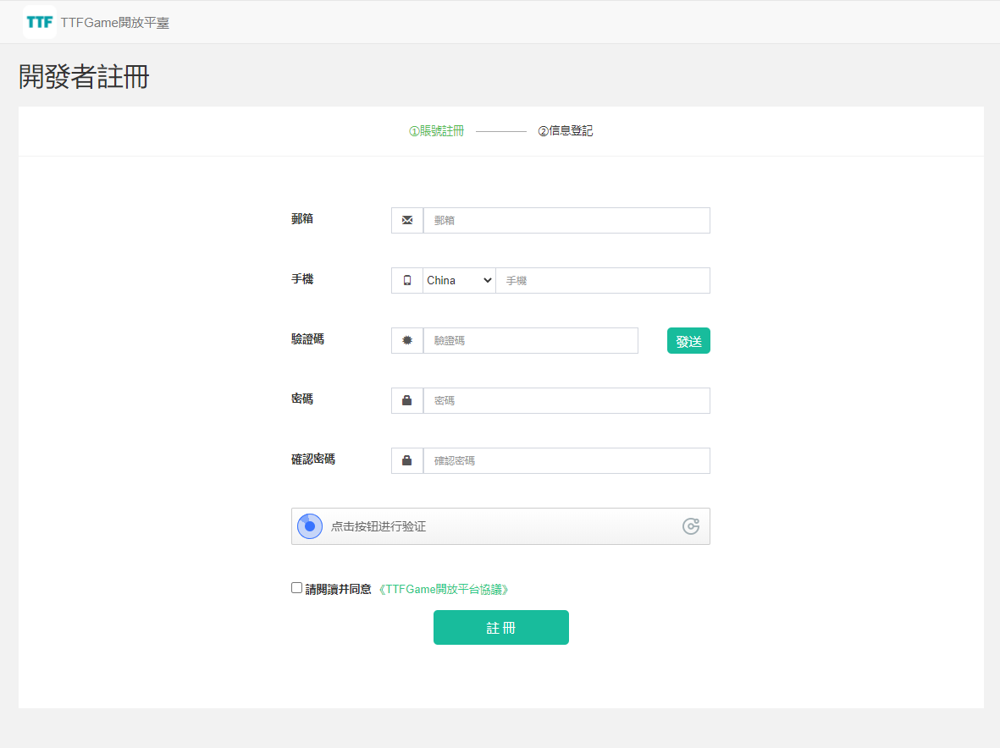
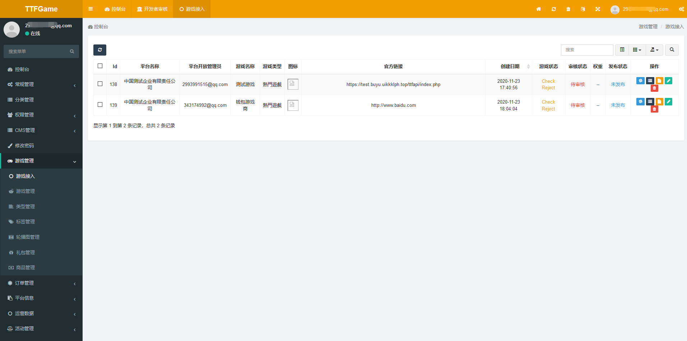
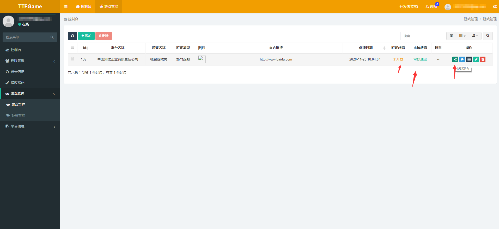

# 1 概述

TTFGame開放平臺是基於TTFGame生態與區塊鏈所打造的開放性遊戲平臺。


> TTFGame生態下有多個基礎平臺支持，當前開放平臺僅針對區塊鏈部分。

  <br />
  <br />

# 2 開發前準備

## 2.1 創建開發者帳號

通過平臺管理員分發給您的位址，創建一個開發者帳號。



錄入資訊等待審核驗證。


## 2.2 添加測試人員帳號

通過驗證以後，可以通過左側功能表添加測試人員帳號。


其中，手機號和密碼是必填項。

## 2.3 創建遊戲

通過驗證以後，可以通過左側功能表創建遊戲。


創建好遊戲以後，需要設置一些必要參數，以便之後接入遊戲。包括：

```
平臺ID
區服ID
支付回檔位址（正式版的服務端支付回檔位址）
登陸位址（正式版的遊戲訪問位址）
官方測試連結（開放平臺測試版的官方連結位址，可與遊戲詳情裡的一致）
支付回檔測試位址（開放平臺測試版的服務端支付回檔位址））
登錄測試位址（開放平臺測試版的遊戲訪問位址）
```


設置完成以後，如果有需要調整的，可點擊編輯按鈕更改。


創建和修改以後，請等待或聯繫平臺管理員進行審核，以便添加和修改的內容生效。


當自行檢測遊戲通過，並經過平臺管理員審核以後，就可以點擊發佈按鈕，發佈遊戲到正式用戶端。


## 2.4 下載測試App

遊戲創建並接入完成後，可以通過平臺管理員提供的[安卓測試App]()來進行測試。

也可以通過平臺管理員提供的[H5版本]()來進行線上測試。

**重要：請使用測試人員帳號登錄，才能看到僅在測試狀態的遊戲。**

## 2.4 審核遊戲

遊戲準備完畢以後，必須聯繫平臺管理員進行審核，才可以進行發佈操作。



## 2.5 發佈遊戲

待審核狀態變為審核通過，點擊“遊戲發佈”按鈕即可發佈。



  <br />
  <br />    

# 3 接入指南

## 3.1 介面說明

### 3.1.1 用戶登錄

**功能**：   玩家進入遊戲

**請求方式**： GET

**請求參數**：

-- 用戶名：       username (urlencode之後的值)

-- 平臺ID：    platform（後臺填寫）

-- App ID：        appid（後臺獲取）

-- 區服ID：        area（後臺填寫，如1,2,3…）

-- 簽名：          sign

-- 師傅用戶名：   invite_user（可能為空）

-- 邀請碼：       shortcode

**簽名規則**： 

`md5('appid=' + [appid] +  '&area=' + [area] + '&key=' + [appkey] + '&platform=' + [platform] + '&username=' + username)`

(appkey為App金鑰；鍵值按a-z排序)

(如果後臺填寫了登錄位址，App的遊戲入口會使用請求參數組裝成訪問位址：[後臺填寫的登錄地址]?username=[username]&appid=[appid]&platform=[platform]&area=[area]&sign=[sign]，否則會直接跳轉填寫的官網地址)


### 3.1.2 支付

#### 3.1.2.1 引入SDK

`<script src="https://game.ttf.one/assets/sdk/toolpack.uni.js"></script>`

初始化sdk
```
var appid = '9348xxxx7579'; //這裡是你的遊戲appid
var tool = new bcpgTool();
tool.init(appid);
```

#### 3.1.2.2 請求支付頁面

##### 發起支付

`tool.initPay({支付參數})`

**參數定義**：

--用戶名：        username (urlencode之後的值)

--平臺ID：         platform (後臺填寫)

--App ID：         appid（後臺獲取）

--區服ID：         area（後臺填寫，如1,2,3…）

--訂單號：        order

--價格：         amount

--商品名       goodsname

--商品數量：     quantity (如：6，不傳則默認為1)

--簽名：         sign

**簽名規則**： 

`md5('appid=' + [appid] +  '&area=' + [area] + '&key=' + [paykey] + '&order=' + [order] + '&platform=' + [platform] + '&username=' + [username])`

(paykey為支付金鑰；鍵值按a-z排序)

##### 用戶端監聽回檔
```
window.addEventListener('pay_back', function(event){
    console.log(JSON.stringify(event.data))
    //用戶端處理返回值
});
```

##### 介面返回
```
資料格式： JSON
code  : 1（無錯誤）/401（未登錄授權）/9201（用戶取消）/0（其他錯誤）
msg :1-確定/401-請登錄後操作/9201-用戶取消/0-沒有找到遊戲資訊/0-沒有找到使用者資訊/0-上傳的金額有誤/0-簽名錯誤
data:{
        order:訂單號,
        username:用戶名,
        platform:平臺ID,
        appid:App ID,
        area:區服ID,
        amount:支付金額,
      method:支付管道
     }
```

##### 回檔地址返回
```
{
        order: 訂單號,
        username: 用戶名,
        platform: 平臺ID,
        appid: App ID,
        area: 區服ID,
        amount: 支付金額,
        goodsname: 商品名,
        quantity: 商品數量,
        goods: 商品ID,
        sign: 簽名
     }
```

**簽名規則**： 

`md5('appid=' + [appid] +  '&area=' + [area] + '&key=' + [paykey] + '&order=' + [order] + '&platform=' + [platform] + '&username=' + [username])`

(paykey為支付金鑰；鍵值按a-z排序)

**重要：接收到回檔以後，請返回字串`success`，以標識成功收到回檔資訊**

## 3.2 其他

### 3.2.1 SDK地址

`https://game.ttf.one/assets/sdk/toolpack.uni.js`

~~(也可使用：`https://cdn.gocloudcache.com/site/client/assets/sdk/toolpack.uni.js`)~~（已棄用，待更新）

### 3.2.2 簽名規則

所有參數按key的ASCII昇冪排列，然後把參數構造成以下格式的字串

`a=xxx&b=xxx&c=xxx`

小寫md5()的結果就是參數中的sign

例如：`md5('appid=' + [appid] +  '&area=' + [area] + '&key=' + [appkey/paykey] + '&order=' + [order] + '&platform=' + [platform] + '&username=' + [username])`

# Changelog

## v0.4.1.2020112809 (2020-11-28)

### 優化

* js-sdk初始化方法變更，必須傳入遊戲appid

